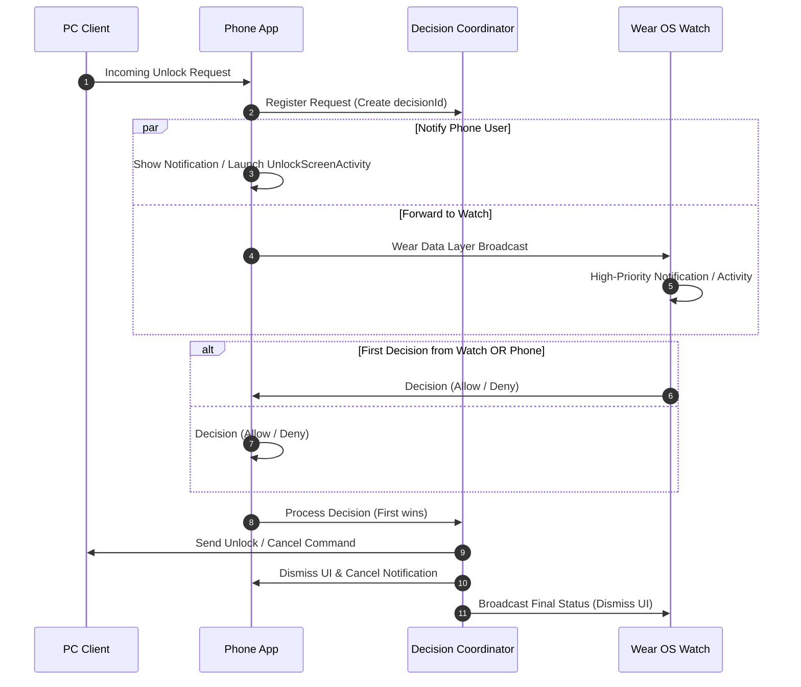

# Portal Project Agent Guidelines

**Portal** is an open-source wireless smart key for Android and Wear OS that transforms your devices
into tools for instant PC unlocking and remote management via Bluetooth (RFCOMM), Local WiFi (
WebSockets), and Wake-on-LAN (WOL).

This document serves as the primary architectural and operational guide for AI agents working in
this repository.

---

## 🏛 Architecture Overview

The project is structured as a **Multi-Module Clean Architecture** with **MVI (Model-View-Intent)**
presentation and **Dagger 2** dependency injection:

```text
Portal/
├── app/                  # Application root, Dagger graph assembly, navigation, background sync
├── wearApp/              # Wear OS companion application (Compose Material 3, MVI)
├── feature/              # Feature modules (isolated UI & business logic)
│   ├── main/             # Main screen, saved devices list, device actions, shortcuts
│   ├── onboarding/       # Initial setup & onboarding flow
│   ├── add-device/       # Device pairing, Bluetooth discovery, WiFi/mDNS scanning
│   ├── device-configuration/ # Device settings, WOL setup, credentials, connection types
│   ├── settings/         # App settings, themes, language, biometrics, wear sync
│   └── logs/             # App logging & diagnostics UI
├── core/                 # Core domain & data infrastructure
│   ├── database/         # Room DB (PortalDataBase), entities, DAOs, schema migrations
│   ├── unlock-service/   # PC communication (WebSockets, RFCOMM, WOL, crypto)
│   ├── compose/          # Shared Compose UI design system, theme, tokens
│   └── android/          # Android platform extensions, coroutine utilities
└── common/               # Reusable utility modules
    ├── biometric/        # Biometric API abstraction, keystore & invalidation handlers
    ├── biometric:compose/# Jetpack Compose biometric prompt integration
    └── preferences-storage/ # Jetpack DataStore / Preferences wrapper
```

> [!NOTE]
> For Wear OS-specific architecture, Scaffold usage, UI guidelines, and MVI constraints,
> see [wearApp/AGENTS.md](file:///x:/xXMRK888YTXx/Coding/Android/Projects/Portal/wearApp/AGENTS.md).

---

## 🔒 Security & Secrets Isolation Rules

1. **Phone-Only Secrets**: All passwords, certificates, encryption keys, IP/MAC addresses, and
   network credentials must **strictly remain on the phone**.
2. **Metadata-Only on Watch**: The Wear OS companion receives metadata only (`clientId`, `name`,
   `transport`, `isWakeOnLanAvailable`). Never serialize or send sensitive credentials over the Wear
   Data Layer.
3. **Biometric Security**: Changes to system biometrics automatically trigger unpairing and cache
   invalidation via `BiometricEnvironmentObserver`.
4. **Local Network Privacy**: All communication with PC clients is direct (local WebSocket /
   Bluetooth RFCOMM); no intermediate cloud servers exist.

---

## 🧩 Architectural Patterns & Conventions

### 1. Feature Module Isolation & Contracts

- Feature modules (`:feature:*`) do **not** depend on each other or directly on the `:app` module.
- Each feature defines pure interface **Contracts** in its `contract/` package (e.g.
  `ProvideSavedDevices`, `SendUnlockRequestContract`, `PermissionContract`).
- The `:app` module implements these contracts in `app/.../providedContract/` and injects them via
  Dagger 2.

### 2. MVI (Model-View-Intent) in UI Layers

- Screens accept an immutable `ScreenState` and an `onEvent: (ScreenEvent) -> Unit` lambda.
- Side-effects (navigation, toasts, biometric prompts) are dispatched via `Channel` / `Flow` as
  `ScreenSideEffect`.
- ViewModels expose state via `StateFlow` and handle events through a centralized
  `onEvent(event: ScreenEvent)` method.

### 3. Dependency Injection (Dagger 2)

- Application-level DI graph is defined in `AppComponent` (`@AppScope`).
- Multibindings are used for Activities (`@ActivityKey`), Services (`@ServiceKey`),
  BroadcastReceivers (`@BroadcastReceiverKey`), and feature modules (`MainScreenModule`,
  `SettingsScreenModule`, etc.).
- When adding new dependencies or features, register their bindings in the corresponding Dagger
  module under `app/.../di/module/`.

### 4. Database & Migrations (`core:database`)

- Local storage uses **Room** (version 3) in `PortalDataBase`.
- Every schema modification **must include an explicit migration** (e.g., `MIGRATION_1_2`,
  `MIGRATION_2_3`) with foreign key constraints preserved.
- Tables with foreign key relations (e.g., `ShortcutEntry` referencing `DeviceEntry(clientId)`) must
  maintain indices on foreign key columns (`@Index("clientId")`) to prevent SQLite full table scans.

---

## 🔄 Core Workflows & Multi-Node Synchronization

### Inbound Unlock Requests (PC -> Phone -> Watch)



- **`IncomingUnlockDecisionCoordinatorImpl`**: Deduplicates incoming decisions between phone and
  watch. Uses a bounded LRU history (`MAX_COMPLETED_HISTORY = 100`) and a 5-minute TTL to prevent
  memory leaks.
- **`finalStatus` Flow**: Exposed as `SharedFlow(replay = 0, extraBufferCapacity = 64)` to ensure
  new subscribers do not receive stale status events.

### Outbound Unlock Commands (Phone / Watch -> PC)

- Routes through `DeviceUnlockManagerImpl` using the preferred or available transport:
    - **WiFi**: Direct WebSocket connection (`WebSocketConnectionImpl`) with optional Wake-on-LAN
      packet.
    - **Bluetooth**: Direct RFCOMM socket (`RfcommBluetoothConnection`).

---

## 📦 ProGuard, R8 & Resource Protection

- **Wear Capability Arrays**: `app/src/main/res/raw/keep.xml` and
  `wearApp/src/main/res/raw/keep.xml` protect `@array/android_wear_capabilities` (
  `portal_phone_app`, `portal_watch_app`) from resource shrinking.
- **Serialization Models**: ProGuard rules (`app/proguard-rules.pro`, `wearApp/proguard-rules.pro`)
  must preserve `@Serializable` data models in `com.xxmrk888ytxx.portal.data.wear.**` and Google
  Play Services Wearable components.

---

## 🛠 Tech Stack Summary

- **Language**: Kotlin 2.x (Coroutines, Flow, Serialization)
- **UI Toolkit**: Jetpack Compose (Material 3), Compose Navigation
- **Architecture**: Multi-module Clean Architecture, MVI
- **DI**: Dagger 2
- **Persistence**: Room Database (SQLite), Jetpack DataStore
- **Networking & Hardware**: WebSockets (OkHttp / Ktor), Bluetooth RFCOMM, mDNS / NSD, Wake-on-LAN (
  UDP Broadcast)
- **Security**: Android BiometricPrompt API, Android Keystore, AES-GCM
- **Build System**: Gradle Kotlin DSL, Version Catalogs (`gradle/libs.versions.toml`), `buildSrc`
  plugins
