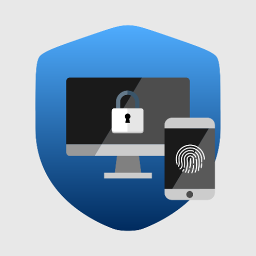
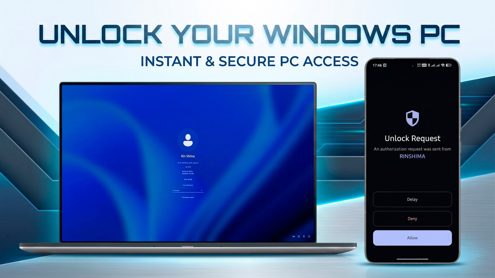
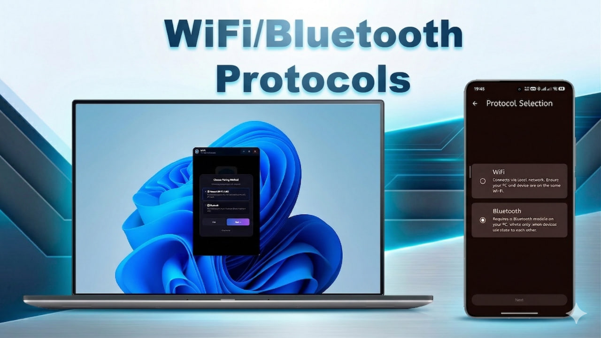
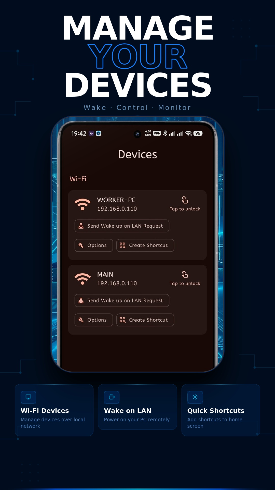
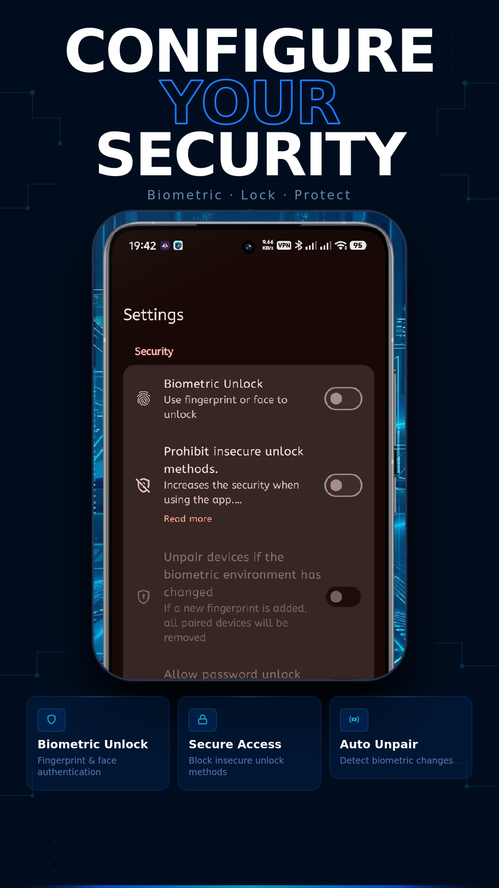
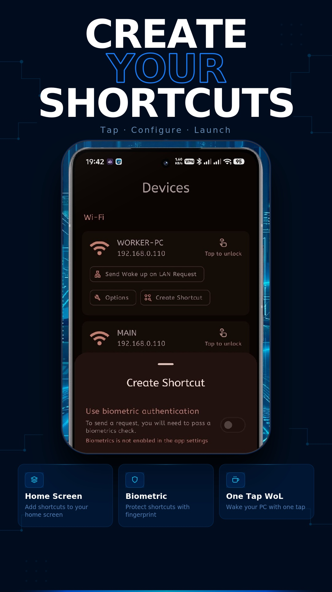

  
  <h1>Portal 🔐</h1>

**Portal** — is a completely **free** and **open-source** smart wireless key that transforms your Android smartphone into a tool for instant computer unlocking. No ads, no tracking, no hidden costs.

## 📲 Links & Downloads

| Platform | Link |
|:---:|:---:|
| **Android (Google Play)** | [Get it on Google Play](https://play.google.com/store/apps/details?id=com.xxmrk888ytxx.portal) |
| **Android (GitHub Releases)** | [Download APK](https://github.com/xXMRK888YTXx/Portal-Android/releases) |
| **PC Client (Windows)** | [Download PC Client](https://github.com/KoksMen/Portal-Windows/releases) |

## ❤️ Support the Project

If you find Portal useful, consider supporting the developers:
- ☕ **[Support via Donate (EN)](https://github.com/xXMRK888YTXx/Portal-Docs/blob/master/Donate/donate-en.md)**
- **Android Developer:** [xXMRK888YTXx](https://github.com/xXMRK888YTXx)
- **PC Client Developer:** [xXKoksMenXx](https://github.com/KoksMen)

## 🚀 How it Works

The application operates in two global modes:
1.  **Unlock from Smartphone:** You initiate the unlock manually from the app or via a home screen shortcut.
2.  **Request from PC:** Your computer sends an authorization request to your phone (e.g., when the PC wakes up). You simply confirm it on your smartphone.

## 📡 Connection Paths

Messages and unlock commands are delivered through:
-   **Bluetooth (RFCOMM):** A direct, stable connection between your phone and PC.
-   **WiFi (WebSockets):** High-speed communication over your local network.
    -   *Includes **Wake-on-LAN (WOL)** support to "wake up" your PC over WiFi before sending the unlock command.*

## 🛡 Features & Security

-   **Biometric Protection:** Use fingerprint or facial recognition to confirm any unlock action.
-   **Quick Shortcuts:** Instant access to specific devices right from your home screen.
-   **Enhanced Security:** Data encryption and automatic device unpairing if system biometric data changes.
-   **Privacy First:** No cloud servers — all communication stays within your local environment.

## 📸 Screenshots

  
  

 

  
  
  

---
*License: GPL-3.0*
---

## 🛠 Technologies & Architecture

-   **Language:** Kotlin (Coroutines, Flow)
-   **UI Framework:** Jetpack Compose (Material 3)
-   **Architecture:** Multi-module, Clean Architecture, MVI (Model-View-Intent)
-   **Dependency Injection:** Dagger 2
-   **Local Storage:** Room (SQLite), Jetpack DataStore (Preferences)
-   **Networking:** WebSockets, Bluetooth RFCOMM, mDNS, Wake-on-LAN (WOL)
-   **Security:** Biometric API, Data Encryption (AES), Secure Storage
-   **Build System:** Gradle Kotlin DSL, Version Catalogs, custom `buildSrc` plugins

## 🔐 Security & Verification

To ensure the authenticity of the application, please verify the build signature. Official builds are signed with one of the following keys:

-   **Google Play Build:** SHA-256 Fingerprint: 11:B8:C9:72:70:0E:87:EB:4E:B9:00:4E:15:68:D8:72:32:87:2C:9F:0F:73:A5:3D:30:E7:CD:CF:49:AF:88:85
-   **Personal Builds:** Signed with the personal key. You can find the valid signature in my [GitHub Profile ReadMe](https://github.com/xXMRK888YTXx).

> [!WARNING]
> Applications signed with any other keys are not built by me. Using such builds is highly discouraged unless you fully trust the provider.

## 📄 Documentation & Links

- 🛡 **[Privacy Policy](https://github.com/xXMRK888YTXx/Portal-Docs/blob/master/Android/Privacy%20policy.md)**
- 📜 **[Terms of Service](https://github.com/xXMRK888YTXx/Portal-Docs/blob/master/Android/Terms%20of%20Service.md)**

  
  <h1>Portal 🔐 (RU)</h1>

**Portal** — это полностью **бесплатный** и **открытый (open-source)** умный беспроводной ключ, который превращает ваш Android-смартфон в инструмент для мгновенной разблокировки компьютера. Без рекламы, без слежки и без скрытых платежей.

## 📲 Ссылки и загрузка

| Платформа | Ссылка |
|:---:|:---:|
| **Android (Google Play)** | [Google Play](https://play.google.com/store/apps/details?id=com.xxmrk888ytxx.portal) |
| **Android (GitHub Releases)** | [Скачать APK](https://github.com/xXMRK888YTXx/Portal-Android/releases) |
| **PC Клиент (Windows)** | [Скачать клиент для ПК](https://github.com/KoksMen/Portal-Windows/releases) |

## ❤️ Поддержка проекта

Если Portal оказался вам полезен, вы можете поддержать разработчиков:
- ☕ **[Поддержать проект (RU)](https://github.com/xXMRK888YTXx/Portal-Docs/blob/master/Donate/donate-ru.md)**
- **Разработчик Android:** [xXMRK888YTXx](https://github.com/xXMRK888YTXx)
- **Разработчик ПК-клиента:** [xXKoksMenXx](https://github.com/KoksMen)

## 🚀 Как это работает

Приложение работает в двух глобальных режимах:
1.  **Разблокировка со смартфона:** Вы сами инициируете разблокировку из приложения или через ярлык на рабочем столе.
2.  **Запрос с ПК:** Ваш компьютер сам отправляет запрос на авторизацию на телефон (например, при пробуждении ПК). Вам остается только подтвердить его на смартфоне.

## 📡 Пути передачи данных

Сообщения и команды разблокировки передаются через:
-   **Bluetooth (RFCOMM):** Прямое и стабильное соединение между телефоном и ПК.
-   **WiFi (WebSockets):** Высокоскоростное взаимодействие через вашу локальную сеть.
    -   *Включает поддержку **Wake-on-LAN (WOL)** для «пробуждения» ПК по сети перед отправкой команды разблокировки.*

## 🛡 Особенности и безопасность

-   **Биометрическая защита:** Использование отпечатка пальца или распознавания лица для подтверждения любого действия.
-   **Быстрые ярлыки:** Мгновенный доступ к разблокировке конкретных устройств прямо с рабочего стола.
-   **Повышенная безопасность:** Шифрование данных и автоматическая отвязка устройств при изменении биометрических данных в системе.
-   **Приватность:** Никаких облачных серверов — все взаимодействие происходит только в вашей локальной среде.

## 📸 Скриншоты

  
  

 

  
  
  

## 🛠 Технологии и архитектура

-   **Язык:** Kotlin (Coroutines, Flow)
-   **UI Фреймворк:** Jetpack Compose (Material 3)
-   **Архитектура:** Многомодульность, Clean Architecture, MVI (Model-View-Intent)
-   **Внедрение зависимостей:** Dagger 2
-   **Хранение данных:** Room (SQLite), Jetpack DataStore (Preferences)
-   **Сеть:** WebSockets, Bluetooth RFCOMM, mDNS, Wake-on-LAN (WOL)
-   **Безопасность:** Biometric API, Шифрование данных (AES), Secure Storage
-   **Сборка:** Gradle Kotlin DSL, Version Catalogs, кастомные плагины в `buildSrc`

## 🔐 Безопасность и проверка

Для обеспечения подлинности приложения проверьте подпись сборки. Официальные версии подписываются одним из следующих ключей:

-   **Версия из Google Play:** SHA-256 Fingerprint: 11:B8:C9:72:70:0E:87:EB:4E:B9:00:4E:15:68:D8:72:32:87:2C:9F:0F:73:A5:3D:30:E7:CD:CF:49:AF:88:85
-   **Персональные сборки:** Подписаны личным ключом. Актуальную сигнатуру можно найти в моем [GitHub профиле](https://github.com/xXMRK888YTXx).

> [!WARNING]
> Приложения, подписанные любыми другими ключами, собраны не мной. Использование таких сборок крайне не рекомендуется, если вы не доверяете автору на 100%.

---
*License: GPL-3.0*
---
